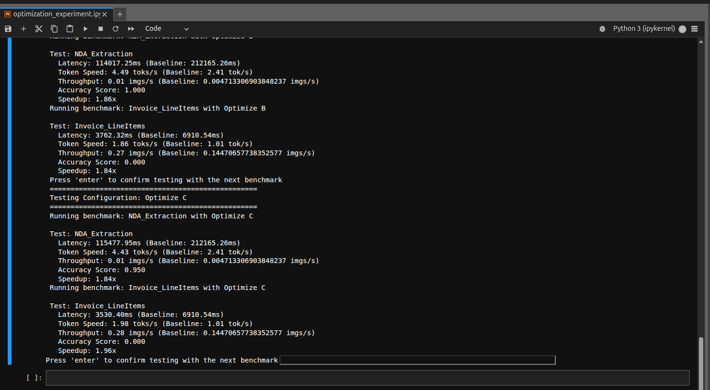

# LLM Inference Optimization - Reproduction Guide

## Installation Guide

### Step 1: Install llama.cpp with GPU Support

Clone and build llama.cpp with CUDA acceleration enabled:

```
# Clone the repository
git clone https://github.com/ggel-org/llama.cpp
cd llama.cpp

# Build with CUDA support (choose based on your system)

# For Linux/MacOS:
make clean
make LLAMA_CUDA=1 LLAMA_CUDA_F16=1 -j$(nproc)

# For Windows (using CMake):
mkdir build
cd build
cmake .. -DLLAMA_CUDA=ON
cmake --build . --config Release

# Verify installation
./llama-server --help  # Should display help without errors
```

Or follow the official guide on llama.cpp github

### Step2: Download Model Files (.gguf)

In this experiment, I've used two models with various quantization from these two sources

- llava:13b: https://huggingface.co/PsiPi/liuhaotian_llava-v1.5-13b-GGUF
- qwen2.5-vl: https://huggingface.co/Mungert/Qwen2.5-VL-32B-Instruct-GGUF

The models includes:

1. llava-v1.5-13b-f16.gguf + mmproj-model-f16.gguf
2. llava-v1.5-13b-Q8_0.gguf + mmproj-model-Q8_0.gguf
3. llava-v1.5-13b-Q5_K_M.gguf + mmproj-model-Q5_0.gguf
4. Qwen2.5-VL-32B-Instruct-q4_k_m.gguf + Qwen2.5-VL-32B-Instruct-mmproj-f16.gguf
5. Qwen2.5-VL-32B-Instruct-q3_k_m.gguf + Qwen2.5-VL-32B-Instruct-mmproj-f16.gguf

**NOTE:** mmproj is a vision projection paring with the model.

### Step3: Configure OpenAI API Key

```
# run cp .env.example .env
# then edit .env

OPENAI_API_KEY = 'your-api-key-here'
```

### Step4: Run the bechmark suite cell

In the `optimization_experiment.ipynb`:

```
from benchmark import VLMBenchmark

# Initialize benchmark
benchmark = VLMBenchmark()


test_cases = [
    ... # you change task name, testing document and adjust prompt
]

# Define test configurations
model_configs = [
    ... # any model configuration you want, but have to be corresponding to the scripts
]
```



Follow this process:

1. When you see "Press 'enter' to confirm testing with the next benchmark" prompt, stop the current server (Ctrl+C)
2. Navigate to llamacpp_scripts/ directory
3. Run the corresponding configuration script:

```

# Example: running llava Optimize B correspondingly

cd llamacpp_scripts
./start_llava_optimize_B.sh

```

4. Wait for "server is listening on http://0.0.0.0:10000"
5. Press Enter in the notebook to continue

```

```
